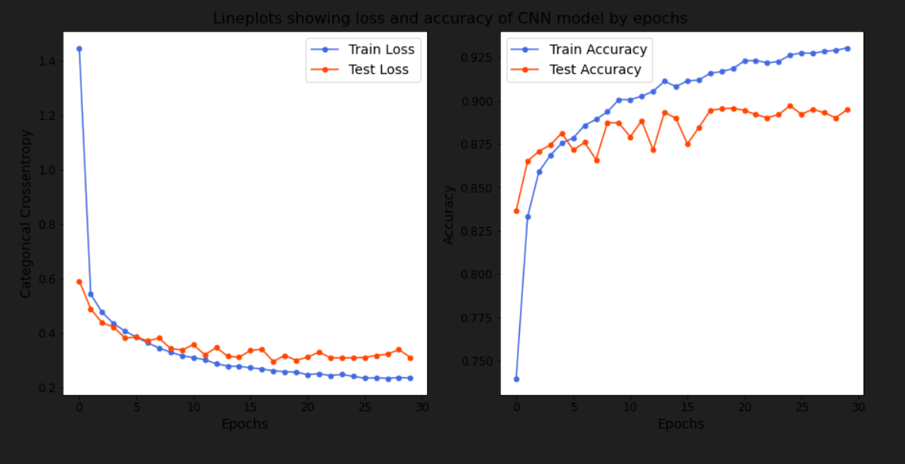
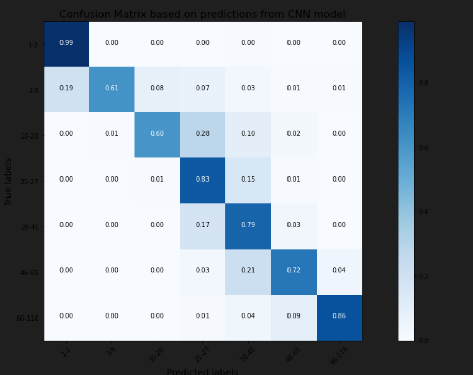

# 📸  Age & Gender Detection  
Deep Learning Project for Real-Time Face Analysis

This project uses the **UTKFace dataset** to train Convolutional Neural Networks capable of predicting **gender** and **age groups** from facial images.  
It includes data preparation scripts, model architectures, training pipelines, and a real-time webcam detection system powered by OpenCV.
Works in real-time (20–30 FPS depending on hardware)


---


# 📊 Results

Result gender_model

<p align="center">
  
</p>

Result Age_model

<p align="center">
  
</p>


## 📂 Project Structure

```bash
Project/
│
├── combined_faces/ # Cleaned & formatted dataset
│
├── dataPreparationSex.py # Preprocessing script for gender labels
├── dataPreparationAge.py # Preprocessing script for age categories
│
├── genderModelSex.py # CNN model architecture for gender detection
├── genderModelAge.py # CNN model architecture for age classification
│
├── trainModelsSex.py # Model training script for gender
├── trainModelsAge.py # Model training script for age
│
├── gender_model.h5 # Pretrained gender model
│
└── webCamDetection.py # Real-time webcam detection script
```


---

## ⚙️ Installation

Make sure you have Python **3.10 – 3.11** installed.

Install dependencies:

```bash
pip install tensorflow
pip install numpy
pip install pandas
pip install opencv-python
pip install matplotlib
```


## 🚀 Future Improvements
Add race/ethnicity classification

Improve age detection using transfer learning (ResNet, MobileNet, etc.)

Build a user interface (Tkinter / PyQt)

Deploy as a web application using Flask or FastAPI

# 🙌 Credits
UTKFace Dataset 
Developed by GK
